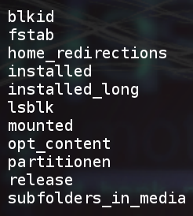

# save_status

## English Short Description

This is a beta of a script, which collects some information about a Linux installation, that I like to know for an reinstallation.  Comments in the generated output files are currently in German.

## Programmanlass

Dieses Skript ist vorläufiges Ergebnis von drei durchgeführten und einer bevorstehenden Linux-Neuinstallation.  Es automatisiert die Ermittlung einiger Informationen, die ich vor einer Neuinstallation von Linux über eine bestehende Installation sammle und zur Verfügung haben möchte.

Das folgende Bildschirmfoto  dokumentiert ein Beispiel, welche Dateien das Skript erzeugt.



Die Dateinamen sprechen für sich und ihr Inhalt sowieso.

## Programmaufruf

```
. save_status <pfad_zum_ziel_verzeichnis>
```

### Konkretes Aufrufbeispiel

```
. save_status /media/pejo/CD87-10B3/Bodhi_2.3.0_vom_PC
```

**Achtung:** Am Ende der Verzeichnisangabe darf kein Schrägstrich stehen!

## Kontakt

Bernd Storck, https://www.facebook.com/BStLinux/